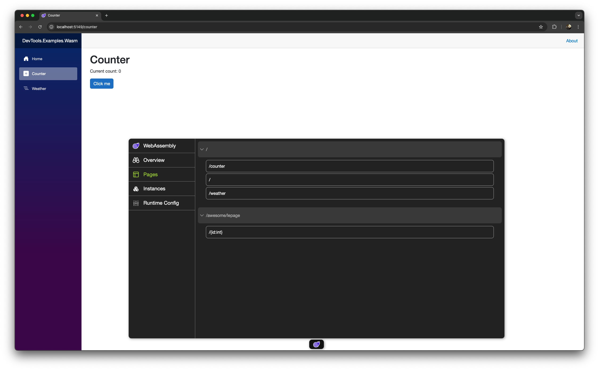
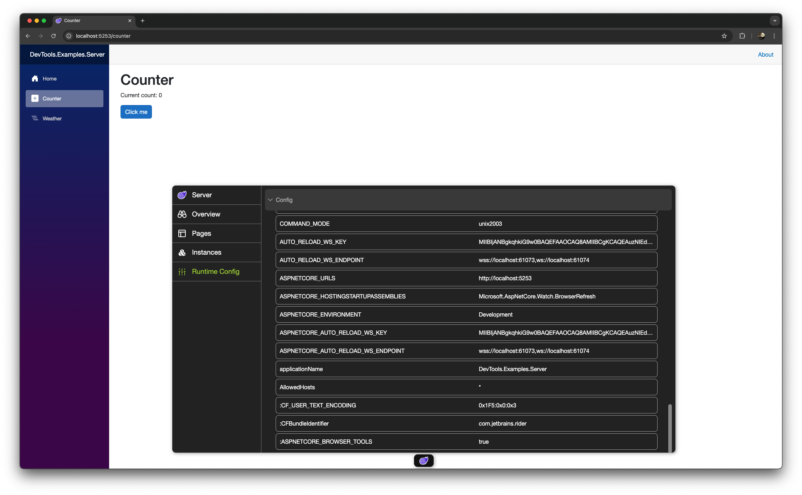
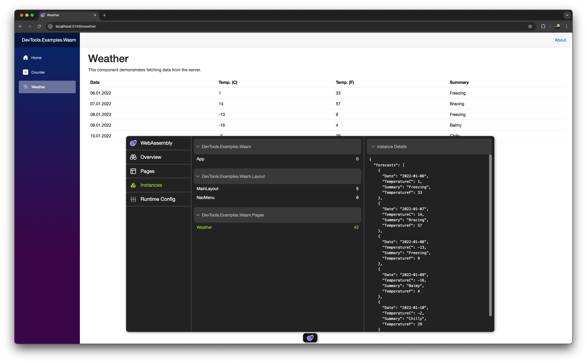

# Blazor DevTools

A basic idea of getting some information about the current Blazor app, like Routes, Rendered components and instance information.
It is hard influenced by the Nuxt.js Devtools.

## Features

- List of routes with navigation to the selected route
- Overview over current rendered components
- Inspection of the component instances (public propeties and private fields)
- Works with Wasm and Server Rendering

## Installation

To use these tools just reference the ```Blazor.DevTools``` project and add the following code:

```csharp

#if DEBUG
builder.AddDevTools();
#endif 

```

You should only reference the package for Debug builds since it uses the ```...lib.module.js ``` auto instantiating mechanism.

## Limitation

There are many other possible things to add into this project. But for now only my most used ones are implemented.  
Feel free to make a PR for adding more stuff.

## Samples

There are a Server and Wasm exmample located in the ```Examples``` directory.

### Screenshots





## License

```MIT License```